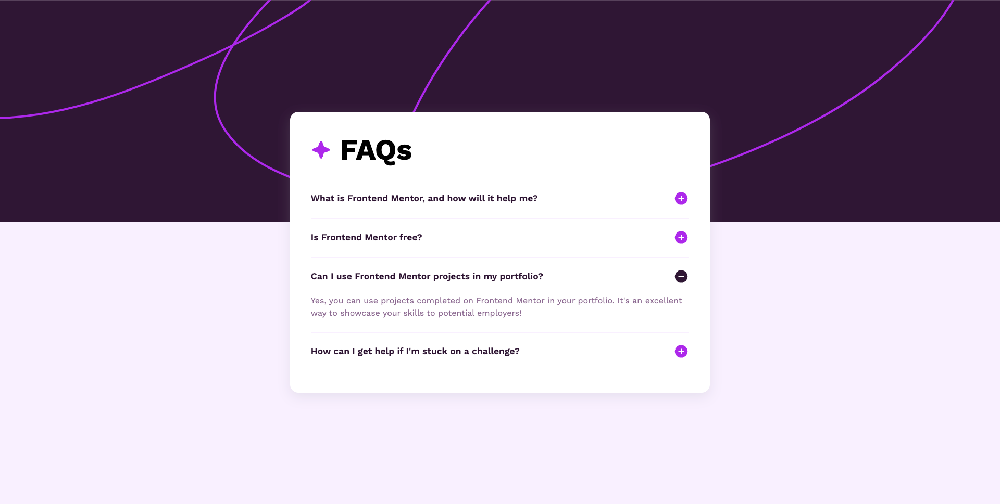

# Frontend Mentor - FAQ accordion solution

This is a solution to the [FAQ accordion challenge on Frontend Mentor](https://www.frontendmentor.io/challenges/faq-accordion-wyfFdeBwBz). Frontend Mentor challenges help you improve your coding skills by building realistic projects. 

## Table of contents

- [Overview](#overview)
  - [The challenge](#the-challenge)
  - [Screenshot](#screenshot)
  - [Links](#links)
- [My process](#my-process)
  - [Built with](#built-with)
  - [What I learned](#what-i-learned)
  - [Continued development](#continued-development)
- [Author](#author)

## Overview

### The challenge

Users should be able to:

- Hide/Show the answer to a question when the question is clicked
- Navigate the questions and hide/show answers using keyboard navigation alone
- View the optimal layout for the interface depending on their device's screen size
- See hover and focus states for all interactive elements on the page

### Screenshot

### Links

- Live Site URL: (https://ryan1731.github.io/faq-accordion-main/)

## My process

### Built with

- Semantic HTML5 markup
- CSS custom properties
- Flexbox
- Mobile-first workflow

### What I learned

Please go easy on me, this is the first challenge I submitted on Frontend Mentor.

I learned to use the DOM to control the height of each question boxes. This challenge was a great way to practice DOM manipulation. Sorry for not attempting to add keyboard navigation. 

### Continued development

I want to continue to focus on writing better forEach loops, and perhaps continue on more DOM-related challenges.

## Author

- Website - [Ryan Tan Yang Heng](https://www.your-site.com)
- Frontend Mentor - [@Ryan1731](https://www.frontendmentor.io/profile/yourusername)